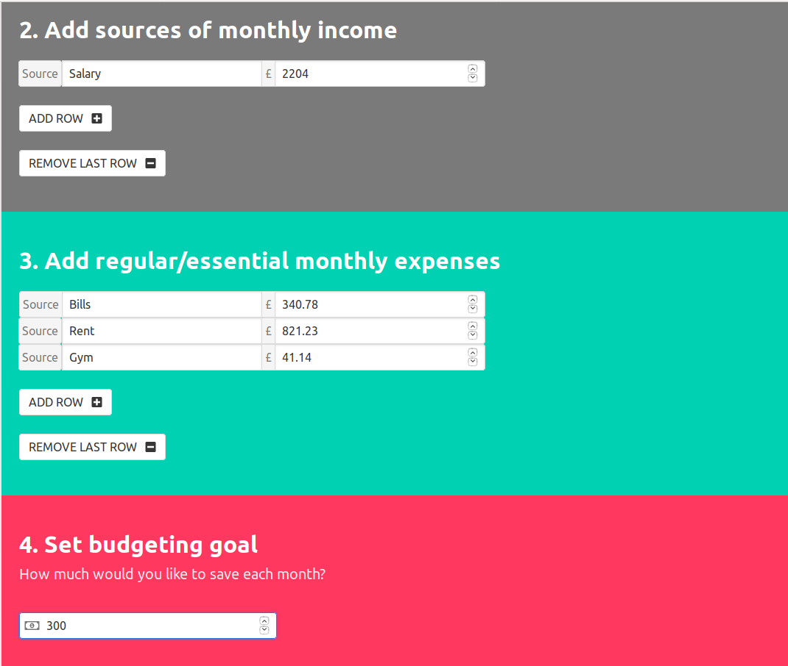
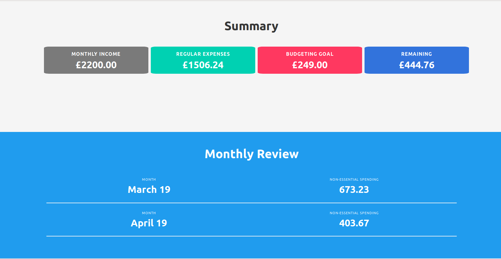
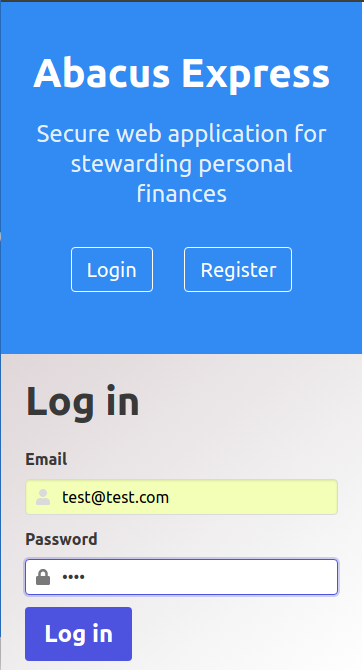

# Abacus-Express
Secure web application for stewarding personal finances 

This responsive CRUD app was built from scratch with Express, Node.js and MongoDB.
User accounts are authenticated securely with Passport.js and Json web tokens.
I designed the front-end from base with HTML5, a flexbox framework and JQuery. 

The application allows users to:
Record their regular income and essential spending 
Set budgeting goals to help save 
Review their monthly non-essential spending 
Update or delete their account

New users are directed to an account set up screen where they enter their details:

The user dashboard uses bold colors and clear summary blocks so that users can quickly and 
clearly see how they are spending and saving:

The application is responsive for mobile and tablet: 
 

